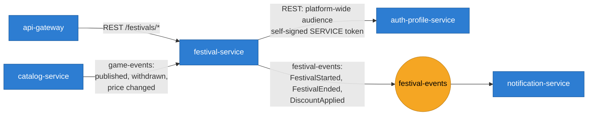

# festival-service

Platform-run sales.

## What this service owns, and what it doesn't

The first three bullets are this service: an Admin creates a festival, selects
the games in it, and runs it through **DRAFT → ACTIVE → ENDED** (or
**CANCELLED**).

The fourth bullet — a discount, proposed by Support and approved by the
developer — is **not** implemented here. It already exists in `catalog-service`
as the `Promotion` aggregate, which carries an opaque `festival_id` for exactly
this purpose. Rebuilding that approval workflow a second time in this service
would produce two answers to "is this game discounted" whenever they disagreed.
Instead, this service:

1. Consumes Catalog's `game-events` to keep a small local read-model of which
   games exist, are published, and what Catalog has decided about their
   promotions.
2. Publishes `arcadia.festival.v1.DiscountApplied` the moment it sees a
   `PromotionApproved` for a game it has selected into one of its festivals —
   the moment the price actually changes for a buyer.

This split was found by reading the already-built `catalog-service` and
`notification-service` repositories rather than guessing:

- `catalog-service`'s `app/domain/promotion.py` and
  `app/adapters/inbound/rest/workflow.py` implement the propose → approve/reject
  → cancel workflow, keyed by `festival_id`.
- `notification-service`'s `app/domain/translation.py` already has a translator
  registered for `arcadia.festival.v1.FestivalStarted`, waiting for this
  service to exist. Its expected payload shape (`name`, `festival_id`,
  `audience`) is what `FestivalService.start` publishes.

## Architecture

Same shape as every other Python service on the platform: Clean Architecture
per service (`domain` → `application` → `adapters`), a transactional outbox for
at-least-once delivery to Kafka, JWT/RBAC at the edge, and RFC 7807 problem
documents for errors. The `app/platform` package is vendored, not shared code —
each service on this platform keeps its own copy so one service's change to it
can't silently move another service's ground under it.

```
app/
  domain/
    festival.py        Festival aggregate: creation, game selection, lifecycle
    catalog_sync.py     Read-model value objects fed by game-events
  application/
    ports.py            Repository/publisher protocols
    events.py            Published and consumed event type names
    dto.py                Request/response shapes
    festival_service.py    Admin use cases (create, select games, lifecycle)
    catalog_sync_service.py  Consumer-driven read-model updates + DiscountApplied
  adapters/
    inbound/
      rest/festivals.py    /v1/festivals — public browsing, Admin-only writes
      consumer.py           Kafka handlers for game-events
    outbound/
      models.py             SQLAlchemy tables
      repositories.py        Postgres repositories
      publisher.py            Outbox-backed event publisher
  bootstrap.py            Wires everything together
  config.py               Settings
  main.py                  ASGI entrypoint
migrations/                festivals, the read-models, the outbox
tests/                      Domain, application, and HTTP-authorisation tests
                             against in-memory fakes — no database needed
```

## Use cases

| # | Use case | Actor | Notes |
|---|---|---|---|
| 1 | Create a festival | Admin | Name, description, window |
| 2 | Reschedule a festival | Admin | Before it starts |
| 3 | Add a game to a festival | Admin | The game must exist and be published |
| 4 | Remove a game from a festival | Admin | |
| 5 | Start a festival | Admin | Explicit, not clock-driven — a demo cannot wait for a start time to arrive |
| 6 | End a festival | Admin | Discounts stop applying |
| 7 | Cancel a festival | Admin | Distinct from ending: it never ran |
| 8 | Browse festivals | Anyone | Public, cached briefly |
| 9 | Read one festival with its games | Anyone | Public |

The discount itself is **not** owned here. A festival proposes one; Catalog holds the
promotion and the developer approves or rejects it. Requirement 1.9 splits the decision
deliberately — Support proposes, the developer decides — and this service owns only the
proposing half.

## How it talks to the rest of the platform



| Direction | Peer | Why |
|---|---|---|
| Calls out (sync) | auth-profile-service | The audience for a platform-wide announcement when a festival starts |
| Consumes | `game-events` | A read-model of which games exist, are published, and at what price — so adding a game to a festival does not need a synchronous call |
| Publishes | `festival-events` | Notification announces a festival to every active user |

## Infrastructure

| Concern | Choice |
|---|---|
| Language | Python 3.13, FastAPI |
| Storage | PostgreSQL — `arcadia_festival`, SQLAlchemy 2 async + Alembic |
| Messaging | Kafka, transactional outbox |
| Cache | Redis — a 30-second cache on the public listing, with no invalidation on write |
| Port | 8089 |
| Deployment | 1 replica, HPA to 4 at 70% CPU |

The listing cache has no invalidation, which is a deliberate trade rather than an
oversight: a newly created festival can take up to 30 seconds to appear publicly, and the
alternative — invalidation across every listing key — is machinery to keep correct for a
page that changes a few times a season.

## Events

Published on `festival-events`:

| Event | When |
|---|---|
| `FestivalCreated` | Admin creates a festival |
| `FestivalGameAdded` / `FestivalGameRemoved` | Admin edits the game list |
| `FestivalStarted` | Admin opens the festival (requires at least one game) |
| `FestivalEnded` | Admin closes a running festival |
| `FestivalCancelled` | Admin calls off a DRAFT or ACTIVE festival |
| `DiscountApplied` | Catalog approves a promotion for a selected game |

Consumed from `game-events` (produced by `catalog-service`):
`GamePublished`, `GameWithdrawn`, `GameRelisted`, `GameUpdated` (the game
read-model), and `PromotionProposed` / `PromotionApproved` / `PromotionRejected`
/ `PromotionCancelled` (the promotion read-model, and the `DiscountApplied`
trigger). `dead_letter_unknown` is off for this router — `game-events` is a
shared topic and most of its traffic (`GameSubmitted`, `GameApproved`, …) is
none of this service's business.

### The `audience` field on `FestivalStarted`

Notification's translator reads an `audience` field — a list of user ids to
notify — and treats an empty/missing list as "nobody to notify". A festival
going ACTIVE is platform-wide (requirement 1.9), so the audience has to be
everyone, and that means asking the service that owns the user directory.

This service now calls `auth-profile-service`'s internal
`GET /v1/admin/users/ids?status=ACTIVE` synchronously from
`FestivalService.start` (see `app/adapters/outbound/auth_profile.py`,
`app/application/festival_service.py`'s `_audience` helper) with a short-lived
service JWT, the same symmetric-secret pattern order-service uses to call
catalog-service (`order-service/app/adapters/outbound/catalog.py`). Configure
the target with `AUTH_PROFILE_BASE_URL` / `AUTH_PROFILE_TIMEOUT_SECONDS`.

That endpoint did not previously exist on auth-profile-service; it was added
(`app/presentation/rest/role_admin_controller.py`'s `GET /admin/users/ids`,
SUPPORT/ADMIN-only, backed by `ListActiveUserIdsUseCase`) as part of this fix,
since restricting an internal, service-to-service directory lookup to the same
role bar as the platform's other bulk user-directory routes was the smallest
consistent change.

The call degrades gracefully rather than blocking a festival from starting: a
timeout, an unreachable auth-profile-service, or a non-2xx response is logged
as a warning and the event still publishes, just with an empty audience — a
missed notification pass is recoverable, an admin unable to start a festival
because a downstream service is down is not. If this ever needs to change (for
example, to retry via an outbox instead of a synchronous call so a temporary
auth-profile-service outage cannot cause a notification gap at all), that is
the next thing to revisit here — not a return to a hardcoded empty list.

## Running it

```
make install   # venv + dependencies
make test      # the full suite — no database or broker needed
make lint      # ruff check + format check
make run       # against the infra compose stack, on :8089
make docker    # build the image
```
